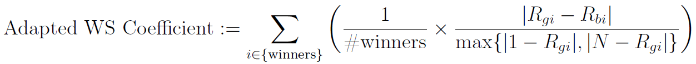

# Gray Box Simulation

To estimate the impact of the [gray box parameters](gray_box_tuning.md), the _OPTANO Algorithm Tuner_ (*OAT*) provides a `gray box simulation`, which takes recorded runtime data of past tunings into account. Based on the provided data log files, it mimics the behaviour of the presented [gray box extension](gray_box_tuning.md) by emulating the predictions of the gray box classifier and analyzing the consequences of its decisions.

> [!NOTE] 
> As this simulation needs data record entries for all target algorithm runs of a tuning, it will throw an exception, if fed with data log files from a past tuning, in which racing was enabled.

## Gray Box Simulation Log Files

The `gray box simulation` will write the following log files, which can be used to evaluate the provided combination of gray box parameters.

### `featureImportance_*.csv`

This file contains the feature importance, given by the gray box simulation random forest, sorted by generations. It may help to detect important gray box features.

### `predictionScores_*.csv`

This file contains the confusion matrix of the gray box random forest, sorted by time point and generation. It may help to compute common classification evaluation metrics like precision and recall. 

Note that these common evaluation metrics should not be the most important important indicators to evaluate this simulation. First, they do not cover the time-dependent classification in the course of the presented gray box extension (i.e. the gray box classifier aims for two contrary goals: accuracy and earliness). Second, the gray box does not care about any wrong gray box cancellations, not affecting the choice of the mini tournament winners. Therefore, the evaluation metrics, contained in `tuningScores_*.csv`, should definitely be considered as well, when evaluating this simulation. 

### `tuningScores_*.csv`

This file contains the following custom evaluation metrics, sorted by generation. These metrics aim to measure the trade-off between runtime savings and quality loss due to gray box cancellations.

#### Approximation of Runtime Savings

The `AveragedRuntimeSavings := 1 - (Averaged Gray Box Run Time of Single Target Algorithm Run / Averaged Black Box Run Time of Single Target Algorithm Run)` can be used to approximate the runtime savings due to gray box cancellations. It holds: The higher the `AveragedRuntimeSavings`, the better. 

#### Approximation of Quality Loss

The `AveragedPercentageOfTournamentWinnerChanges` between the provided black box tuning and simulated gray box tuning can be used to approximate the quality loss due to gray box cancellations. While this metric is easy to interpret, it does not take any quality measurement of the tournament winner changes into account. It holds: The lower the `AveragedPercentageOfTournamentWinnerChanges`, the better. 

The `AveragedAdaptedWsCoefficient` overcomes this disadvantage by measuring the averaged normalized black box rank of the gray box tournament winners. It is inspired by the [Wojciech Sałabun coefficient of rankings similarity](https://link.springer.com/chapter/10.1007/978-3-030-50417-5_47) and is defined on mini tournament level as follows. 



Here, R<sub>gi</sub> (resp. R<sub>bi</sub>) is the rank of the i-th element in the gray box mini tournament ranking (resp. black box mini tournament ranking). It holds: The lower the `AveragedAdaptedWsCoefficient`, the better. 

### `instanceCounts_*.csv`

This file contains the counts of cancelled / finished runs per tuning, staggered by instances. It may help to detect an overfitting of the gray box random forest on potential instance features.

## Exemplary Implementation

When facing the provided [Gurobi adapter](gurobi.md), the following code snippet can be used to start several gray box simulations.

```java
var dataRecordDirectoryPath = "DataLogFiles";
var timeout = TimeSpan.FromSeconds(300);
var maximumNumberParallelThreads = Environment.ProcessorCount;

var grayBoxStartGenerations = new List<int>()
			{
				5,
			    10,
			};

var grayBoxStartTimePoints = new List<TimeSpan>()
			{
				TimeSpan.FromSeconds(timeout.TotalSeconds * 0.1),
				TimeSpan.FromSeconds(timeout.TotalSeconds * 0.2),
			};

var grayBoxProbabilityThresholds = new List<double>()
			{
                0.5,
                0.75,
			};

var grid = (from grayBoxStartGeneration in grayBoxStartGenerations
			from grayBoxStartTimePoint in grayBoxStartTimePoints
			from grayBoxProbabilityThreshold in grayBoxProbabilityThresholds
			select new GrayBoxSimulationConfiguration(
				grayBoxStartGeneration,
				grayBoxStartTimePoint,
				grayBoxProbabilityThreshold)).ToList();

var algorithmTunerConfiguration = new AlgorithmTunerConfiguration.AlgorithmTunerConfigurationBuilder()
	.SetDataRecordDirectoryPath(dataRecordDirectoryPath)
	.SetCpuTimeout(timeout)
	.SetMaximumNumberParallelThreads(maximumNumberParallelThreads)
	// While the maximum number of parallel evaluations is not used during a gray box simulation, it needs to be set, when building an algorithm tuner configuration.
	.SetMaximumNumberParallelEvaluations(1)
	.Build();
	
var gurobiRunnerConfiguration = new GurobiRunnerConfiguration.GurobiRunnerConfigBuilder().Build(timeout);
var gurobiRunnerFactory = new GurobiRunnerFactory(gurobiRunnerConfiguration, algorithmTunerConfiguration);
var gurobiGrayBoxMethods = new GurobiGrayBoxMethods();
var gurobiRunEvaluator = new GurobiRunEvaluator(timeout);
var gurobiParameterTree = GurobiUtils.CreateParameterTree();

using var simulation = new GrayBoxSimulation<GurobiRunner, InstanceSeedFile, GurobiResult>(
	algorithmTunerConfiguration,
	gurobiRunnerFactory,
	gurobiGrayBoxMethods,
	gurobiRunEvaluator,
	gurobiParameterTree);

foreach (var element in grid)
{
	simulation.Run(element);
}
```