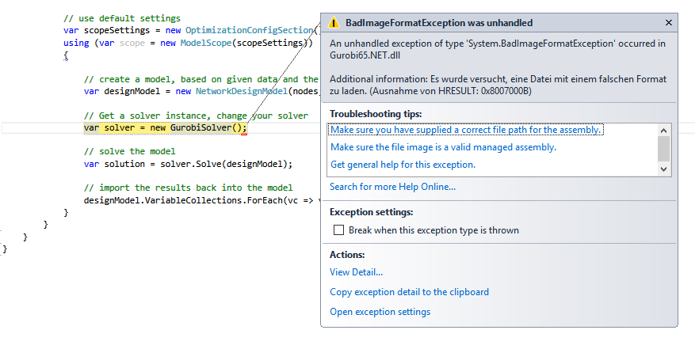
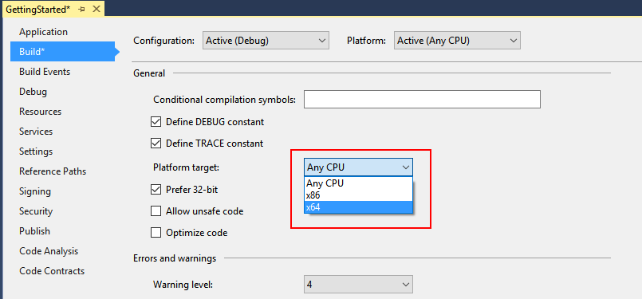

# Bad Image Exception

    An unhandled exception of type 'System.BadImageFormatException' occurred in Gurobi65.NET.dll (Exception of HRESULT: 0x8007000B)

Your .net Application and the library to load are not using both x86 or x64 mode.

Fixing in Visual Studio,  Go into the project's setting 
1. Solution Explorer: Project > Properties (in context menu) 
2. In new Windows: Go to section build > set Platform target to appropriate setting

